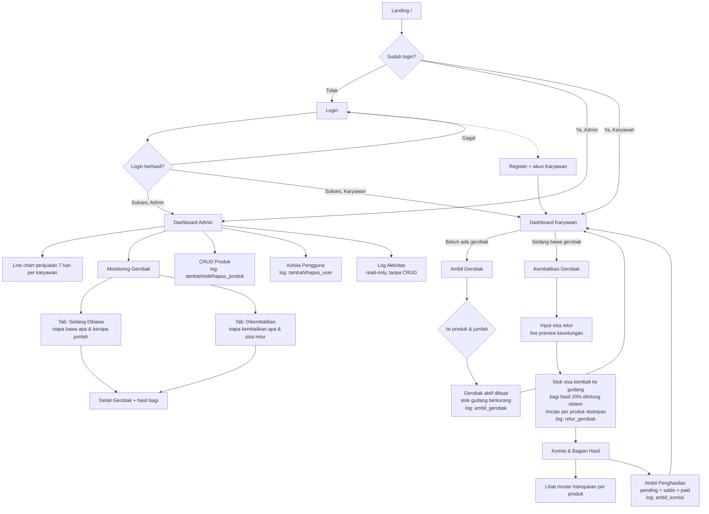

# Alur Halaman & Navigasi

## Penjelasan Ringkas

1. **Login / Register** — `/login` dan `/register`. Registrasi publik selalu membuat akun ber-role
   `employee`. Redirect otomatis sesuai role.
2. **Dashboard Karyawan** — menampilkan status gerobak, isi gerobak aktif (produk, jumlah, nilai),
   komisi terakhir, dan daftar produk.
3. **Ambil Gerobak** — wajib tanpa gerobak aktif. Pilih produk + jumlah; sistem memvalidasi stok
   (row lock), memotong stok, dan mencatat log `ambil_gerobak`.
4. **Kembalikan Gerobak** — input jumlah sisa (retur). Sistem menghitung `terjual = diambil − sisa`,
   mengembalikan sisa ke stok, menghitung keuntungan & bagian karyawan, menyimpan rincian per produk
   (`commission_items`), dan mencatat log `retur_gerobak`.
5. **Komisi & Bagian Hasil** — riwayat komisi dengan rincian transparan per produk (accordion),
   rumus perhitungan, dan tombol "Ambil Penghasilan" (pending → saldo, log `ambil_komisi`).
6. **Dashboard Admin** — statistik umum + line chart penjualan per karyawan 7 hari terakhir
   (multi-line, filter per karyawan).
7. **Monitoring Gerobak** — read-only. Tab "Sedang Dibawa" menampilkan siapa membawa produk apa
   beserta jumlah; tab "Dikembalikan" menampilkan siapa mengembalikan apa, jumlah terjual, dan
   sisa retur yang kembali ke gudang.
8. **Log Aktivitas** — read-only (tidak ada tombol tambah/ubah/hapus). Filter berdasarkan kata kunci,
   jenis aksi, dan rentang tanggal. Data diisi otomatis oleh observer & event.
9. **Logout** — mencatat log `logout` lalu kembali ke halaman login.

## Daftar Aksi pada Log Aktivitas

| action | Dipicu oleh |
|--------|-------------|
| `login` / `logout` | Event auth (login & logout) |
| `register` | Registrasi publik |
| `ambil_gerobak` | CartController::ambilGerobak |
| `retur_gerobak` | CartObserver (status → returned) |
| `ambil_komisi` | CommissionObserver (status → paid) |
| `tambah_produk` / `edit_produk` / `hapus_produk` | ProductObserver |
| `tambah_user` / `hapus_user` | UserObserver |
