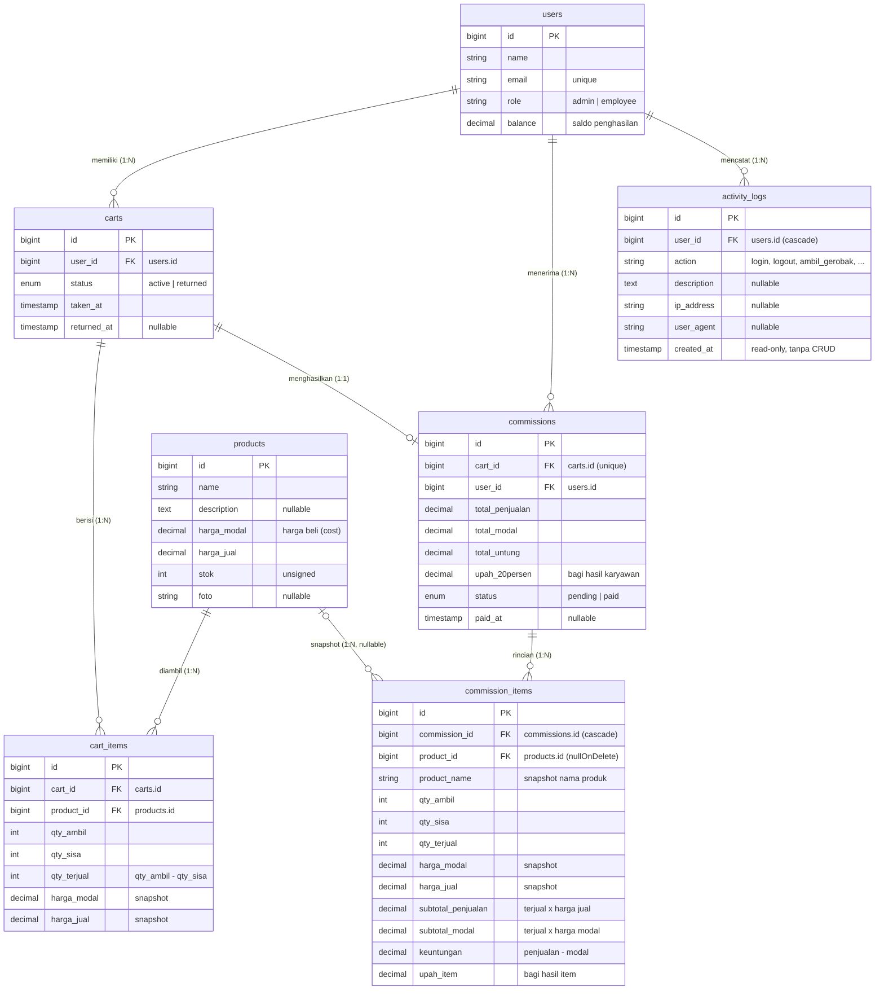

# ERD & Skema Basis Data

Skema berikut menggambarkan seluruh tabel beserta relasi Primary Key (PK) dan Foreign Key (FK).

## Catatan Desain

1. **Snapshot harga** — `cart_items.harga_modal` / `harga_jual` disimpan saat gerobak diambil agar
   perhitungan bagi hasil tidak berubah walau harga produk diedit admin.
2. **Snapshot rincian komisi** — `commission_items` menyimpan nama produk + perhitungan per item.
   `product_id` memakai `nullOnDelete` sehingga riwayat tetap utuh walau produk dihapus.
   (Perbaikan dari `cart_items` yang masih `cascadeOnDelete`.)
3. **Log aktivitas** — `activity_logs` tidak memiliki route CRUD sama sekali; hanya ditulis otomatis
   oleh observer/event dan dibaca admin.
4. **Satu komisi per gerobak** — `commissions.cart_id` ber-`unique` (1:1).
5. **Persentase bagi hasil** — dari `config/komisi.php`, nilai di-snapshot ke `upah_20persen`
   dan `commission_items.upah_item` saat gerobak dikembalikan.

## Index yang Dipakai

- `activity_logs`: `user_id`, `created_at` (untuk filter & sorting log)
- `commission_items`: `commission_id` (untuk rincian per komisi)
- `commissions`: `cart_id` unique, `user_id` (untuk riwayat karyawan & chart)
